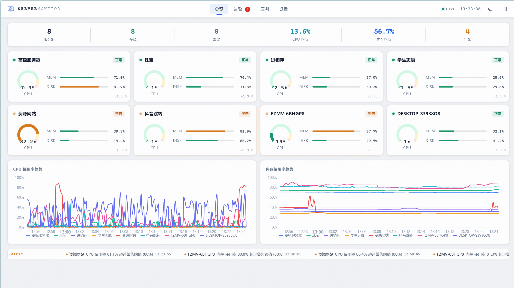
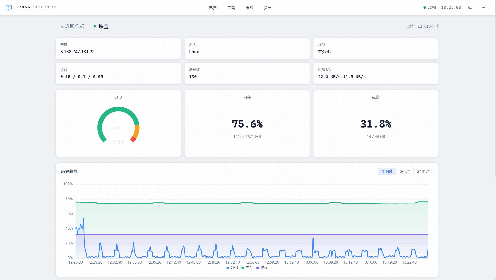
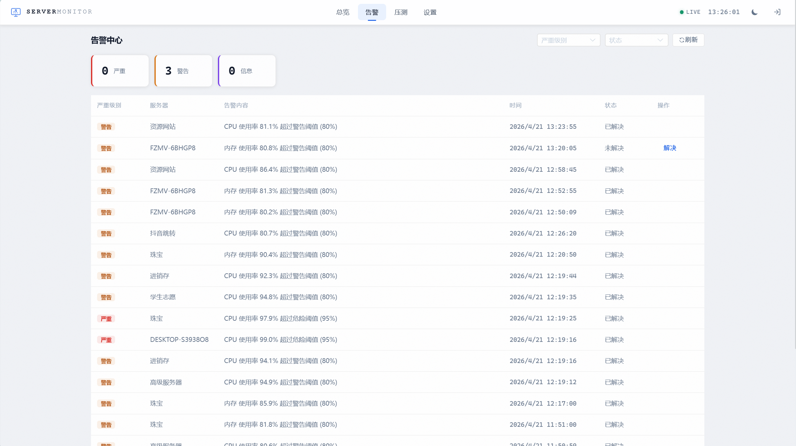
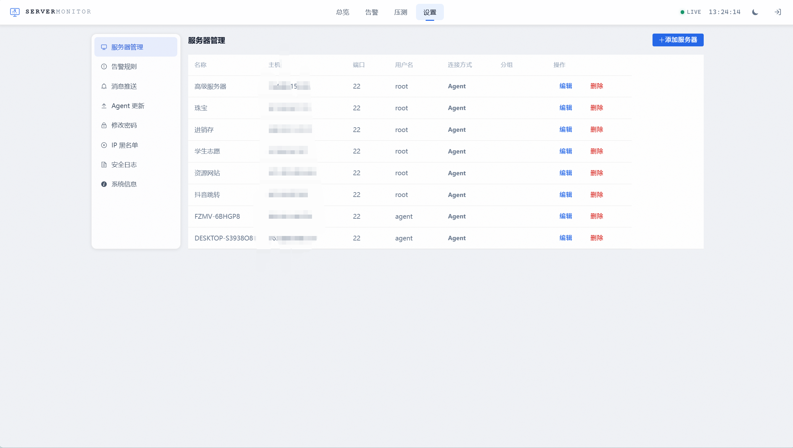

# 🖥️ Server Monitor - 全栈服务器监控系统

一套轻量级、全功能的服务器监控解决方案。Go + Vue3 全栈开发，单二进制部署，支持 Linux / Windows 跨平台监控。



---

## ✨ 功能特性

| 功能 | 说明 |
|------|------|
| **实时监控** | CPU、内存、磁盘、网络、负载、进程数、运行时长 |
| **趋势图表** | ECharts 可视化，多服务器对比，自动按负载排序 |
| **远程终端** | 浏览器内 SSH 终端，支持 Linux PTY / Windows ConPTY |
| **压力测试** | 5 种模式（HTTP/HTTPS/CC/带宽/TCP），分布式多节点执行 |
| **Agent 管理** | 一键推送更新，自动回滚保护，跨平台支持 |
| **告警通知** | CPU/内存/磁盘阈值告警，支持 Webhook 推送 |
| **暗黑/亮色主题** | 全局主题切换，所有组件适配 |
| **单文件部署** | 前端资源嵌入 Go 二进制，一个文件搞定服务端 |

---

## 📸 功能截图

### Dashboard - 服务器总览

实时展示所有服务器状态，CPU/内存/磁盘一目了然，支持正常/警告/离线状态标识。底部 CPU 和内存趋势图默认显示负载最高的 3 台服务器，底部告警滚动条实时推送告警信息。


### 服务器详情

点击服务器卡片进入详情页，查看主机信息、负载、进程数、网络 I/O，以及 CPU/内存/磁盘的实时仪表盘和历史趋势图（支持 1小时/6小时/24小时切换）。



### 告警中心

按严重级别分类（严重/警告/信息），展示所有告警记录，支持按服务器和状态筛选，可一键解决。



### 系统设置 - 服务器管理

管理所有被监控服务器，支持 Agent 模式自动注册，查看连接方式、分组等信息。



---

## 🏗️ 技术架构

```
                    ┌─────────────────────┐
                    │     浏览器 (Vue3)     │
                    │  TypeScript + ECharts │
                    └────────┬────────────┘
                             │ HTTP / WebSocket
                    ┌────────▼────────────┐
                    │    Go Server (Gin)   │
                    │  SQLite + embed 前端  │
                    │  端口 5000           │
                    └────────┬────────────┘
                             │ WebSocket (双向)
              ┌──────────────┼──────────────┐
              ▼              ▼              ▼
        ┌──────────┐  ┌──────────┐  ┌──────────┐
        │ Agent    │  │ Agent    │  │ Agent    │
        │ Linux    │  │ Windows  │  │ Linux    │
        │ 服务器 A  │  │ 服务器 B  │  │ 服务器 C  │
        └──────────┘  └──────────┘  └──────────┘
```

| 层级 | 技术栈 |
|------|--------|
| **前端** | Vue 3 + TypeScript + Vite + SCSS + ECharts + Pinia |
| **后端** | Go 1.21+ / Gin / SQLite / gorilla/websocket / embed |
| **Agent** | Go 跨平台编译 / WebSocket / PTY / 自更新 |
| **部署** | 单二进制（前端嵌入），零依赖 |

---

## 📦 项目结构

```
server-monitor/
├── agent/                    # Agent 端（部署到被监控服务器）
│   ├── main.go               # 主程序：上报、WebSocket、自更新、回滚
│   ├── stress.go             # 压力测试引擎（5种模式，支持 HTTPS）
│   ├── metrics_linux.go      # Linux 指标采集（/proc）
│   ├── metrics_windows.go    # Windows 指标采集（WMI）
│   ├── pty_unix.go           # Linux 终端 PTY
│   ├── pty_windows.go        # Windows 终端 ConPTY
│   ├── watchdog.go           # 进程守护 + 开机自启
│   ├── install.sh            # Linux 一键安装脚本
│   └── kill-agent.bat        # Windows 停止脚本
│
├── server/                   # 服务端
│   ├── main.go               # 入口：启动 HTTP + WebSocket
│   ├── embed.go              # 前端静态资源嵌入
│   └── internal/
│       ├── config/           # 配置管理
│       ├── handler/          # API 路由处理
│       │   ├── agent.go      # Agent WebSocket 管理
│       │   ├── agent_update.go # Agent 上传/下载/推送更新
│       │   ├── metric.go     # 指标上报 + 趋势数据
│       │   ├── terminal.go   # Web 终端代理
│       │   ├── stress.go     # 压测任务分发
│       │   ├── alert.go      # 告警管理
│       │   └── auth.go       # JWT 认证
│       ├── model/            # 数据模型 + SQLite
│       ├── service/          # 业务逻辑（采集、通知、SSH）
│       └── ws/               # WebSocket Hub（广播、签名验证）
│
├── web/                      # 前端 Vue 3 项目
│   └── src/
│       ├── views/
│       │   ├── Dashboard.vue    # 首页总览
│       │   ├── ServerDetail.vue # 服务器详情 + 终端
│       │   ├── StressTest.vue   # 压力测试配置
│       │   ├── Alerts.vue       # 告警列表
│       │   ├── Settings.vue     # 系统设置
│       │   └── Login.vue        # 登录页
│       ├── components/
│       │   ├── ServerCard.vue      # 服务器状态卡片
│       │   ├── TrendChart.vue      # 趋势图（ECharts）
│       │   ├── StatusOverview.vue  # 状态概览栏
│       │   └── AlertTicker.vue     # 告警滚动条
│       └── stores/monitor.ts  # Pinia 状态 + WebSocket
│
└── docs/                     # 文档
    ├── 技术架构文档.md
    ├── API接口文档.md
    └── UI设计文档.md
```

---

## 🚀 快速开始

### 环境要求

- **Go** 1.21+
- **Node.js** 18+（编译前端）
- **目标服务器**：Linux amd64 或 Windows amd64

### 第一步：编译前端

```bash
cd web
npm install
npm run build
```

### 第二步：编译服务端

```bash
# 将前端产物复制到服务端
cp -r web/dist server/frontend

# 编译服务端（Linux 部署）
cd server
CGO_ENABLED=0 GOOS=linux GOARCH=amd64 go build -o server-monitor-linux .
```

### 第三步：编译 Agent

```bash
cd agent

# Linux Agent
CGO_ENABLED=0 GOOS=linux GOARCH=amd64 go build -o agentlinux .

# Windows Agent
CGO_ENABLED=0 GOOS=windows GOARCH=amd64 go build -o agent-windows.exe .
```

### 第四步：部署服务端

```bash
# 上传 server-monitor-linux 到服务器
chmod +x server-monitor-linux
./server-monitor-linux

# 服务启动后访问 http://服务器IP:5000
# 默认管理员账号：admin / admin123（首次登录请修改密码）
```

### 第五步：安装 Agent

在每台需要监控的服务器上执行：

**Linux：**
```bash
curl -fsSL http://服务器IP:5000/api/agent/install | bash
```

**Windows（以管理员身份运行 PowerShell）：**
```powershell
irm http://服务器IP:5000/api/agent/install-win | iex
```

安装完成后 Agent 会自动注册并开始上报数据，刷新管理面板即可看到新服务器。

---

## 📖 使用指南

### 监控 Dashboard

打开管理面板首页即可看到所有服务器的实时状态：
- **绿色 · 正常**：所有指标在阈值内
- **橙色 · 警告**：CPU/内存/磁盘超过警告阈值
- **红色 · 离线**：Agent 超过 60 秒未上报

底部趋势图默认显示 CPU/内存负载最高的 3 台服务器，点击图例名称可切换显示其他服务器。

### 远程终端

1. 点击任意服务器卡片进入详情页
2. 点击「终端」标签
3. 即可在浏览器内直接操作服务器（支持 Tab 补全、Ctrl+C 等快捷键）
4. Linux 使用 PTY，Windows 使用 ConPTY，体验接近原生 SSH

### 压力测试

1. 进入「压力测试」页面
2. 选择模式（HTTP Flood / HTTPS Flood / CC / 带宽洪水 / TCP 洪水）
3. 输入目标 URL、并发数、持续时间
4. 选择执行节点（可多选，分布式执行）
5. 点击「开始测试」，实时查看 RPS、成功率、延迟、带宽等指标

### Agent 推送更新

1. 进入「设置」→「Agent 更新」
2. 分别上传 Linux 和 Windows 的 Agent 二进制文件
3. 点击「推送更新」，选择目标平台
4. 所有在线 Agent 会自动下载新版本、替换、重启

### 告警配置

1. 进入「设置」→「告警配置」
2. 设置 CPU/内存/磁盘的告警阈值
3. 配置 Webhook 推送地址（可选）
4. 超过阈值时自动触发告警并推送通知

---

## ⚡ 压力测试详解

| 模式 | 协议 | 策略 | 适用场景 |
|------|------|------|----------|
| **HTTP Flood** | HTTP/HTTPS | 高并发 GET/POST，自动 HTTP/2 | Web 服务压测 |
| **HTTPS Flood** | HTTPS | 70% HTTP/2 复用 + 30% 新 TLS 握手 | HTTPS 服务 CPU 压测 |
| **CC 攻击** | HTTP/HTTPS | 每次请求唯一 URL，穿透缓存 | CDN / 缓存压测 |
| **带宽洪水** | HTTP/HTTPS | 大包 POST（伪装 multipart），KeepAlive | 上行带宽压测 |
| **TCP 洪水** | TCP/TLS | 大量 TCP/TLS 连接建立 | 连接数限制压测 |

所有模式自动适配 HTTPS：
- 启用 TLS 会话缓存加速重连
- HTTP/2 多路复用减少握手开销
- 随机 User-Agent + 请求头伪装
- 支持自定义请求头和 Body

---

## 🔄 Agent 更新机制

```
管理面板上传新 Agent
        │
        ▼
  点击「推送更新」
        │
        ▼
  Server 通过 WebSocket 发送更新指令
        │
        ▼
  Agent 收到指令 ──▶ 用自身 SERVER_URL 构建下载地址
        │                    （确保内网机器也能下载）
        ▼
  下载新二进制（120s 超时，失败重试 3 次）
        │
        ▼
  校验文件大小（≥ 1MB）
        │
        ▼
  ┌─ Linux: rename 旧文件为 .bak → rename 新文件
  └─ Windows: rename 或 copy 覆盖（双重策略）
        │
        ▼
  启动新版本进程 → 退出旧进程
        │
        ▼
  回滚保护（120s 内上报失败则自动回滚）
  回滚后删除 .bak 防止死循环
```

---

## 🔒 安全特性

- **JWT 认证**：所有 API 需要登录后的 Token
- **WebSocket 签名**：Agent 命令使用 HMAC-SHA256 签名，防止伪造
- **TLS 支持**：Agent ↔ Server 支持 HTTPS/WSS
- **自动注册**：Agent 首次启动自动注册，无需手动配置 Token

---

## 🛠️ 配置说明

### 服务端环境变量

| 变量 | 默认值 | 说明 |
|------|--------|------|
| `PORT` | `5000` | HTTP 监听端口 |
| `JWT_SECRET` | 随机生成 | JWT 签名密钥 |
| `DB_PATH` | `data.db` | SQLite 数据库路径 |

### Agent 配置文件

Agent 安装后会在同目录生成 `agent.conf`：

```ini
SERVER_URL=http://服务器IP:5000
AGENT_TOKEN=自动注册获取的Token
INTERVAL=10
SIGN_KEY=签名密钥
```

---

## 📄 License

MIT
